# Projektdokumentation - [TaskStudy]

## Inhaltsverzeichnis

1. [Ausgangslage](#1-ausgangslage)
2. [Lösungsidee](#2-lösungsidee)
3. [Vorgehen & Artefakte](#3-vorgehen--artefakte)
    1. [Understand & Define](#31-understand--define)
    2. [Sketch](#32-sketch)
    3. [Decide](#33-decide)
    4. [Prototype](#34-prototype)
    5. [Validate](#35-validate)
4. [Erweiterungen [Optional]](#4-erweiterungen-optional)
5. [Projektorganisation [Optional]](#5-projektorganisation-optional)
6. [KI-Deklaration](#6-ki-deklaration)
7. [Anhang [Optional]](#7-anhang-optional)

> **Hinweis:** Massgeblich sind die im **Unterricht** und auf **Moodle** kommunizierten Anforderungen.

## 1. Ausgangslage
Studierende müssen während ihres Studiums verschiedene Module, Aufgaben, Prüfungstermine und persönliche Lernziele gleichzeitig organisieren. Oft sind diese Informationen auf mehrere Plattformen wie Kalender, Notiz-Apps oder Lernplattformen verteilt. Dadurch geht schnell der Überblick verloren, Aufgaben werden vergessen oder zu spät begonnen und der organisatorische Aufwand steigt.

TaskStudy soll Studierende dabei unterstützen, ihre studienrelevanten Informationen zentral an einem Ort zu verwalten und den Überblick über anstehende Aufgaben, Lernziele und Prüfungen zu behalten.
- **Problem:** 
Es fehlt häufig ein zentrales System zur Verwaltung von Modulen, To-dos, Lernzielen und Prüfungsterminen. Dies kann zu Unübersichtlichkeit, Prokrastination und zusätzlichem Stress führen.
- **Ziele:** 
  - Übersicht über alle studienrelevanten Aufgaben und Termine schaffen
  - Zeitmanagement und Selbstorganisation verbessern
  - Lernfortschritt durch klare Modul- und Lernzielstruktur unterstützen
  - Stress durch bessere Planung und Transparenz reduzieren
- **Primäre Zielgruppe:** 
Studierende, die mehrere Module, Aufgaben und Prüfungstermine organisieren und ihren Studienalltag strukturierter gestalten möchten.
- **Weitere Stakeholder:** 
  - Dozierende (indirekt durch besser organisierte Studierende)
  - Coaches oder Mentorinnen und Mentoren, die Studierende bei der Studienorganisation unterstützen

## 2. Lösungsidee
TaskStudy ist eine Study-Planner-App, welche die wichtigsten organisatorischen Funktionen des Studienalltags in einer zentralen Anwendung vereint. Nutzerinnen und Nutzer können Module verwalten, Lernziele festlegen, Aufgaben organisieren sowie Prüfungstermine und weitere wichtige Termine erfassen.

Die Startseite bietet einen schnellen Überblick über aktuelle To-dos, den Lernfortschritt sowie bevorstehende Prüfungen und Termine. Dadurch können Studierende ihre Aufgaben priorisieren und ihren Lernfortschritt einfacher verfolgen.
- **Kernfunktionalität:** 
  - Dashboard mit Übersicht über aktuelle To-dos und Prüfungstermine
  - Module erstellen und verwalten
  - Lernziele pro Modul erfassen und als erledigt markieren
  - To-dos erstellen, verwalten und abschliessen
  - Termine und Prüfungstermine verwalten
  - Lernfortschritt pro Modul visualisieren
  - Module als Favoriten markieren
  - Navigation zwischen Startseite, Modulübersicht und Aufgabenbereichen
- **Annahmen:**
  - Eine zentrale Plattform verbessert die Übersicht über studienrelevante Informationen.
  - Eine Verknüpfung von Modulen, Lernzielen und Aufgaben unterstützt die Lernorganisation.
  - Eine einfache und übersichtliche Benutzeroberfläche erhöht die Nutzungsbereitschaft.
- **Abgrenzung:** 
  - Keine KI-gestützten Lernempfehlungen
  - Keine sozialen oder kollaborativen Funktionen
  - Kein vollständiger Ersatz für Lernplattformen wie Moodle
  - Fokus auf persönliche Studienorganisation und Planung

## 3. Vorgehen & Artefakte
Die Durchführung erfolgt phasenbasiert; dokumentieren Sie die wichtigsten Ergebnisse je Phase.

### 3.1 Understand & Define
- **Zielgruppenverständnis:** 
Als Studentin bin ich selbst Teil der primären Zielgruppe und kenne die Schwierigkeiten aus eigener Erfahrung. Dazu gehören insbesondere das Vergessen von Aufgaben, das Aufschieben von Lernphasen bis kurz vor Prüfungen sowie der Verlust des Überblicks über verschiedene Module und Deadlines.

Aus meinen Erfahrungen und der Analyse haben sich folgende Probleme gezeigt:
- Zeitmanagement bei mehreren parallel laufenden Modulen
- Fehlende Struktur und Priorisierung beim Lernen
- Stress durch vergessene oder kurzfristig erledigte Aufgaben
- Verteilte Informationen auf unterschiedliche Plattformen wie Moodle, Kalender oder Notiz-Apps

Zusätzlich habe ich bestehende Lösungen wie StudySmarter angeschaut. Dabei ist mir aufgefallen, dass viele dieser Anwendungen sehr umfangreich sind und zahlreiche Funktionen bieten. Für die reine Studienorganisation wirken sie jedoch teilweise überladen. Zudem stehen einige Funktionen nur in kostenpflichtigen Versionen zur Verfügung. Daraus entstand die Idee, eine einfache und übersichtliche Anwendung zu entwickeln, die sich auf die Organisation des Studienalltags konzentriert.
- **Wesentliche Erkenntnisse:**
  - Viele Studierende vergessen Aufgaben oder beginnen zu spät mit der Bearbeitung.
  - Moodle dient primär als Lernplattform, bietet jedoch keine zentrale, alltagsnahe Organisationslösung.
  - Bestehende Apps sind oft zu komplex oder enthalten unnötige Zusatzfunktionen.
  - Eine reduzierte, agendaähnliche App mit Fokus auf To-dos, Termine und Module könnte den Studienalltag sinnvoll ergänzen.
### 3.2 Sketch
- **Variantenüberblick:** Im Rahmen der Ideensammlung wurden mehrere Varianten für die Struktur und Funktionen der Anwendung entwickelt. Dabei wurden unterschiedliche Möglichkeiten zur Darstellung von Terminen, Prüfungen und Lernfortschritten untersucht. Einige Varianten setzten auf eine klassische Kalenderansicht, während andere Termine in einer Listenansicht darstellten. Zudem wurden zusätzliche Funktionen wie eine separate Prüfungsübersicht, ein Fokus-Timer, das Hochladen von Dateien sowie die Bewertung von Lernsessions skizziert. Ziel war es herauszufinden, welche Funktionen für Studierende tatsächlich hilfreich sind und wie diese möglichst übersichtlich dargestellt werden können.
- **Skizzen:** Im Rahmen der Crazy-8s-Methode habe ich mehrere Lösungsansätze für die Anwendung entwickelt. Die einzelnen Skizzen unterscheiden sich vor allem in der Darstellung von Terminen, Prüfungen, Lernfortschritten und zusätzlichen Funktionen.
  - **Startseite:** Übersicht über die heutigen To-dos sowie den Lernfortschritt der einzelnen Module.
  - **Kalenderansicht:** Termine und Aufgaben werden in einer klassischen Kalenderansicht dargestellt, um einen Überblick über die zeitliche Planung zu ermöglichen.
  - **Modulansicht:** Anzeige der To-dos, Herausforderungen und Lernfortschritte eines einzelnen Moduls.
  - **Prüfungsansicht:** Prüfungen werden auf einer separaten Seite dargestellt, damit wichtige Prüfungstermine unabhängig von anderen Terminen sichtbar sind.
  - **Journal-/Dateiansicht:** Möglichkeit, Dateien und Lernunterlagen hochzuladen und zu verwalten.
  - **Fokus-Timer:** Unterstützung konzentrierter Lernphasen durch einen integrierten Timer.
  - **Bewertungsansicht:** Lernsessions können bewertet werden, um den eigenen Lernfortschritt und die Effektivität der Lernzeit zu reflektieren.

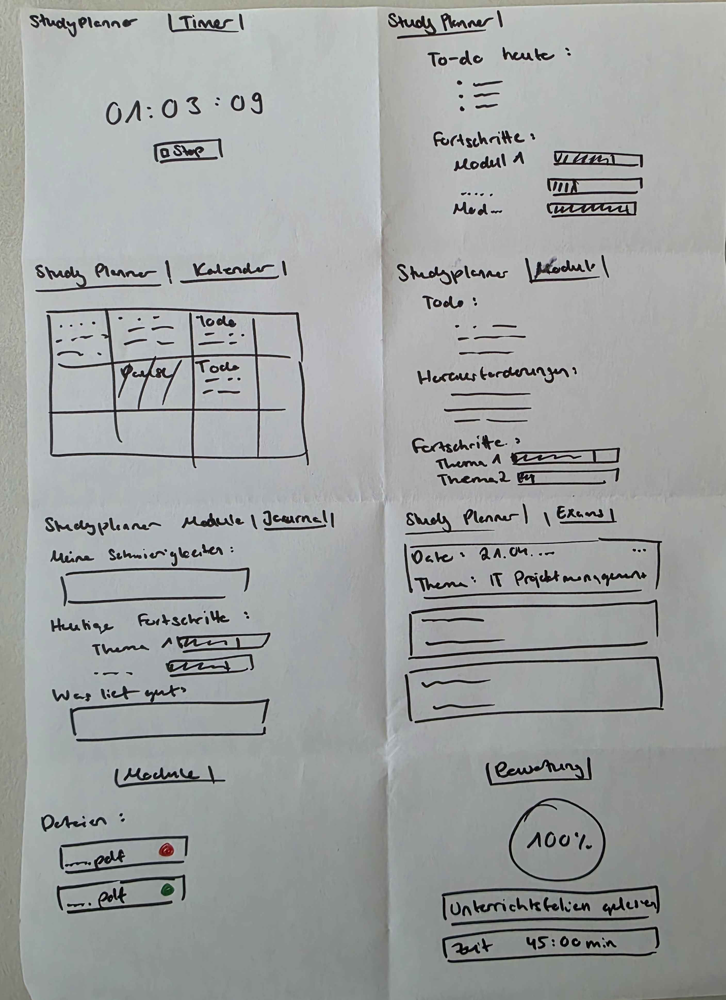

Während des Skizzierens habe ich verschiedene Möglichkeiten zur Darstellung von Terminen ausprobiert. In einer Variante wurden Termine in einer Kalenderansicht dargestellt. In einer anderen Variante wurden sie als Liste angezeigt. Die Listenansicht wirkte dabei übersichtlicher, da wichtige Termine und Prüfungen schneller erfasst werden können.

Auch die Prüfungen waren zunächst als eigene Seite geplant. Die Idee dahinter war, Prüfungstermine klar von anderen Terminen zu trennen und separat darzustellen.

Anschliessend habe ich Feedback zu den Skizzen eingeholt. Besonders positiv bewertet wurde die zentrale Übersicht über Lernfortschritte und Aufgaben. Ausserdem wurde vorgeschlagen, wichtige Termine und Prüfungen direkt auf der Startseite anzuzeigen, damit sie jederzeit sichtbar sind. Aufgrund dieses Feedbacks habe ich mich entschieden, die wichtigsten Termine und Prüfungstermine zusätzlich auf der Startseite zu integrieren.

### 3.3 Decide
- **Gewählte Variante & Begründung:** Basierend auf den Skizzen und dem erhaltenen Feedback wurde eine Variante gewählt, die den Fokus auf Übersichtlichkeit und einfache Bedienung legt. Die Startseite wurde so gestaltet, dass die wichtigsten Informationen direkt sichtbar sind. Dazu gehören aktuelle To-dos, Lernfortschritte der Module sowie bevorstehende Prüfungstermine und übrige wichtige Termine.

Die Entscheidung fiel auf diese Variante, da sie die wichtigsten Informationen ohne unnötige Komplexität darstellt und Studierende dadurch schneller einen Überblick über ihre Aufgaben erhalten. Zusätzlich ermöglicht es die direkte Verlinkung zu den Modulenseiten und damit einen schnellen Zugriff auf die Lernziele und To-Dos.
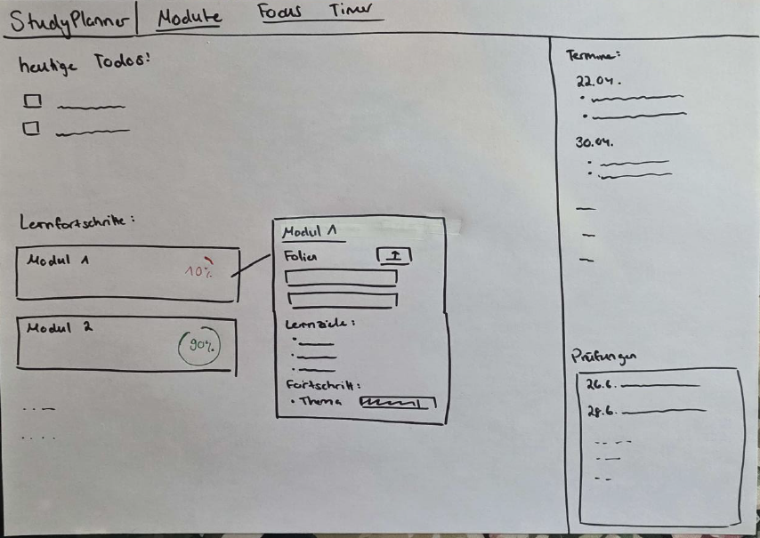
- **End-to-End-Ablauf:**
  1. Die Nutzerin oder der Nutzer öffnet die Startseite und erhält einen Überblick über aktuelle To-dos, Lernfortschritte sowie bevorstehende Termine und Prüfungen.
  2. Über die Modulübersicht können bestehende Module eingesehen oder neue Module erstellt werden.
  3. Innerhalb eines Moduls können Lernziele verwaltet und als erledigt markiert werden.
  4. Über die Terminübersicht können neue Termine, Prüfungstermine und To-dos erfasst werden.
  5. Alle wichtigen Informationen werden zentral auf der Startseite dargestellt, sodass der aktuelle Lernstand jederzeit sichtbar ist.
- **Mockup:**
https://www.figma.com/proto/FuEVr0Ug7O3wiwPe6l42qx/StudyPlanner?node-id=0-1&t=JeL9XfYHCEZeJTad-1

Auf der Startseite erhält die Nutzerin oder der Nutzer einen schnellen Überblick über aktuelle To-dos, bevorstehende Termine und Prüfungstermine. Zusätzlich werden die vorhandenen Module sowie deren Lernfortschritt angezeigt, sodass die wichtigsten Informationen direkt sichtbar sind.
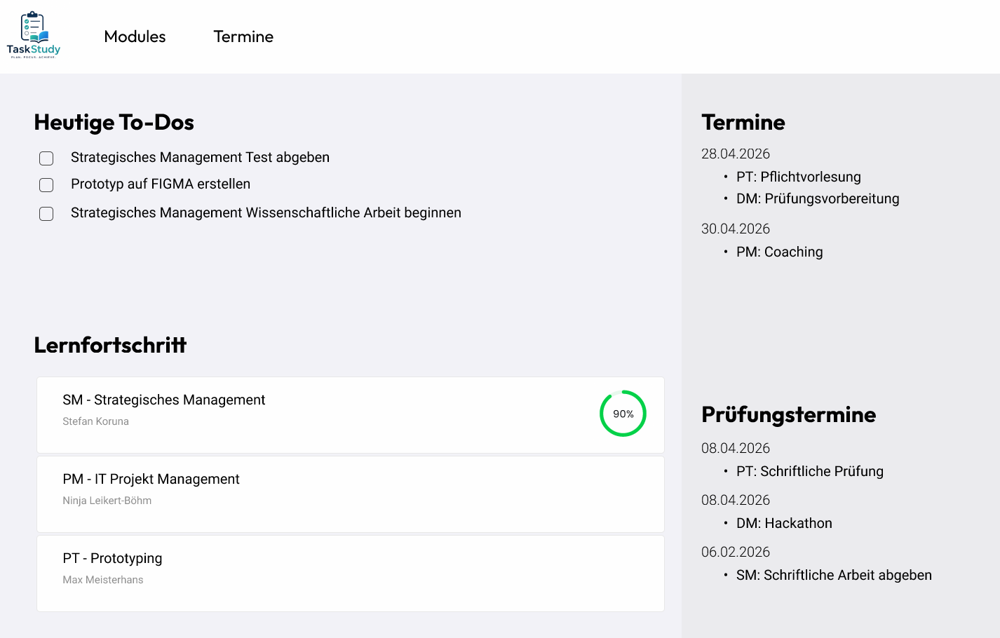

Die Modulübersicht zeigt alle erstellten Module an. Von hier aus können bestehende Module ausgewählt oder neue Module hinzugefügt werden.
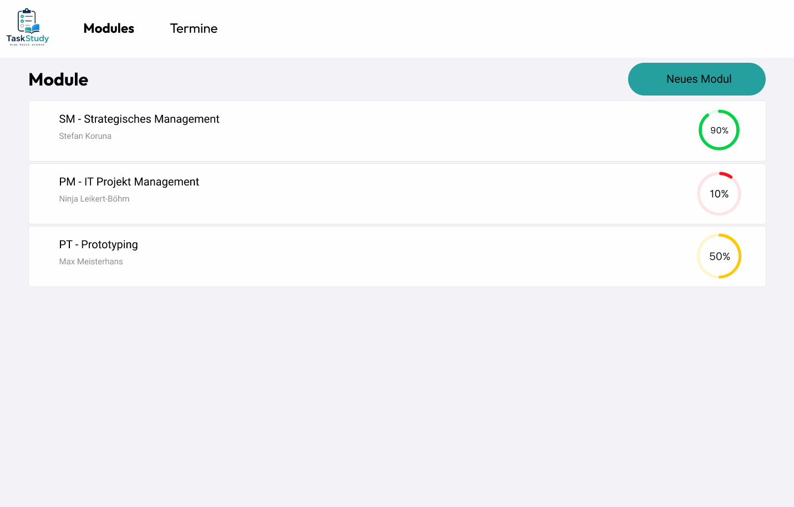

Auf der Modulseite werden die Lernziele und To-Dos eines einzelnen Moduls angezeigt.
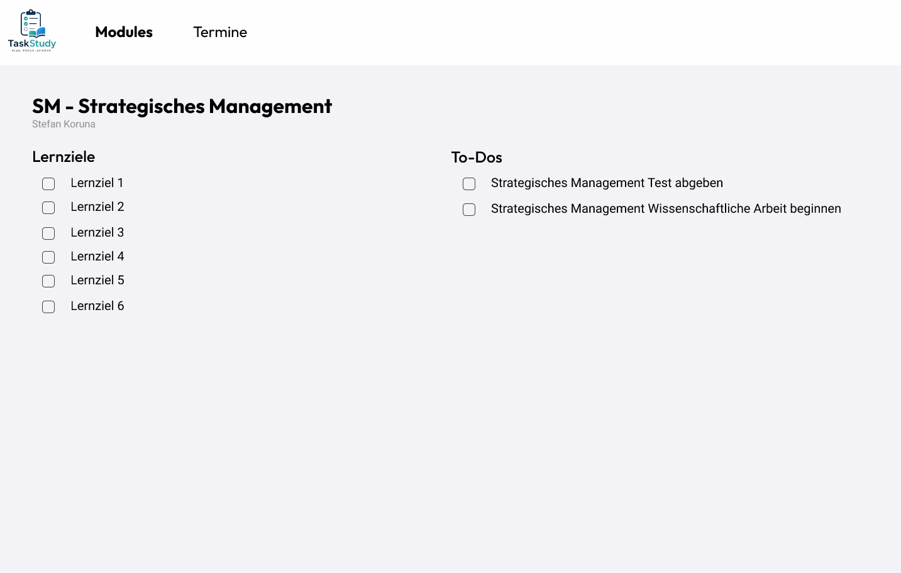

Über diese Seite können neue Module erstellt werden. Dabei muss man den Dozenten und den Namen vom Modul angeben.
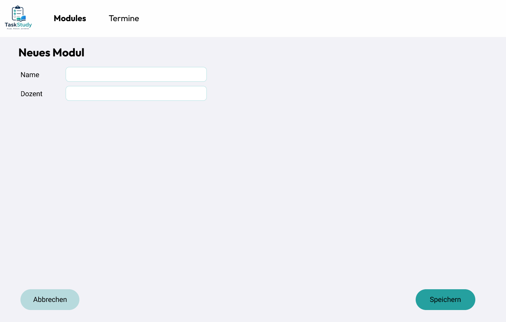

Die Terminübersicht zeigt alle erfassten Termine, Prüfungstermine und To-Dos an. Dadurch können anstehende Ereignisse einfach eingesehen und erledigt werden.
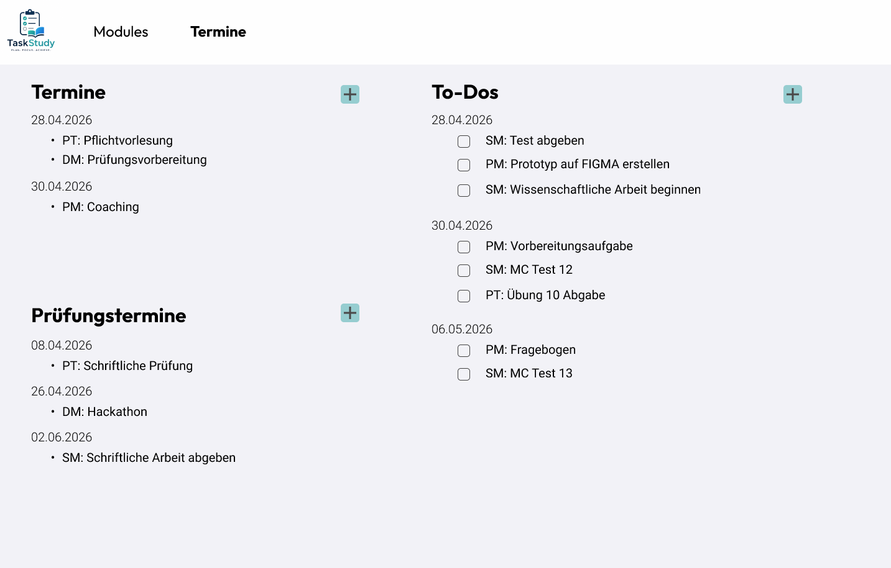

Auf dieser Seite können neue Termine, Prüfungstermine oder To-dos erfasst werden. Die Eingabe erfolgt über ein Formular mit den wichtigsten Informationen zum jeweiligen Eintrag.
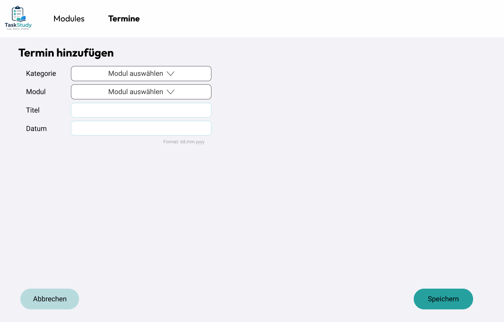

### 3.4 Prototype

#### 3.4.1. Entwurf (Design)
Beschreibt die Gestaltung und Interaktion.
> **Hinweis:** Hier wird der **Prototyp** beschrieben, nicht das **Mockup**.
- **Informationsarchitektur:** Die Anwendung besteht aus drei zentralen Bereichen: Dashboard, Module und Termine. Über die Navigationsleiste können Benutzer zwischen den Bereichen wechseln.

Das Dashboard bietet eine Übersicht über die heutigen To-Dos, den Lernfortschritt der Module sowie anstehende Termine und Prüfungstermine. Im Bereich „Module“ werden alle Module angezeigt. Jedes Modul besitzt eine Detailseite mit Lernzielen und modulbezogenen To-Dos. Im Bereich „Termine“ werden To-Dos, Termine und Prüfungstermine verwaltet.

Die Navigation wurde einfach gehalten, damit Benutzer schnell zwischen den wichtigsten Funktionen wechseln können.
- **User Interface Design:**
**Startseite:** Die heutigen To-Dos und der Lernfortschritt werden links angezeigt, Termine und Prüfungstermine rechts. Um diese Bereiche klar voneinander zu trennen, wurde die rechte Spalte etwas dunkler gestaltet. Die Filter sind bewusst dezent gehalten, damit der Fokus auf den Inhalten und den wichtigsten Aktionen liegt.
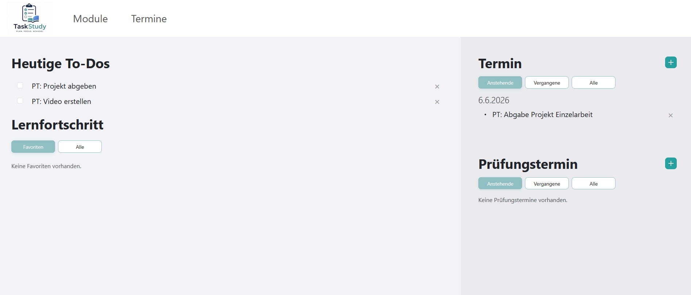

**Modulerstellung:** Auf dieser Seite können Module erstellt und direkt mit Lernzielen ergänzt werden. Über den Button „Hinzufügen“ lassen sich weitere Lernziele hinzufügen. Die Lernziele können aber auch später auf der Modulseite ergänzt werden. Durch die unterschiedlichen Farben ist sofort erkennbar, welcher Button die Hauptaktion („Modul erstellen“) ausführt und welche Buttons nur unterstützende Funktionen haben.
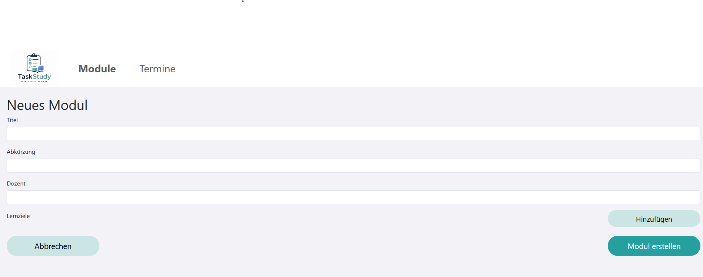

**Modulübersicht:** Die Module wurden bewusst schlicht und modern dargestellt. Neben den wichtigsten Informationen wie Modulname und Dozent wird auf der rechten Seite der aktuelle Lernfortschritt grafisch angezeigt. Dadurch ist auf einen Blick erkennbar, wie weit der Lernstand bereits fortgeschritten ist und bei welchen Modulen noch Lernbedarf besteht. Die Favoritenfunktion ermöglicht es zudem, häufig genutzte Module schnell hervorzuheben und zu finden.
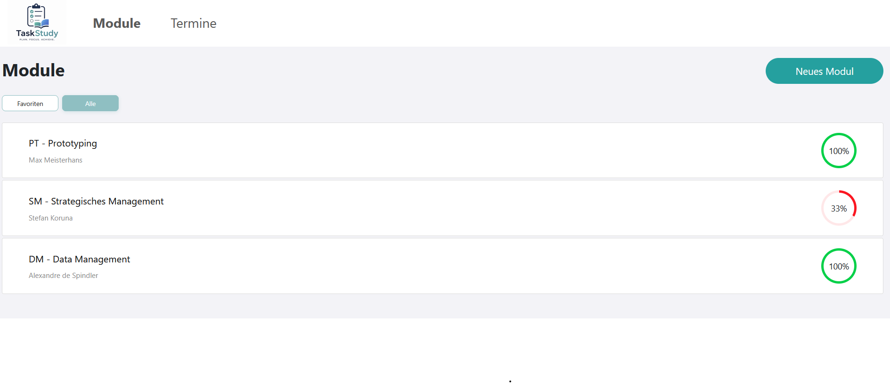

- **Designentscheidungen:** Für die Anwendung wurde zuerst ein eigenes Logo mit ChatGPT erstellt. Die Farben und die grobe Gestaltung des Logos wurden dabei vorgegeben und dienten anschliessend als Grundlage für das gesamte Design der Anwendung. Die Akzentfarben der Benutzeroberfläche orientieren sich direkt am Logo und sorgen für ein einheitliches Erscheinungsbild.

Bei der Gestaltung habe ich bewusst auf ein helles und schlichtes Design gesetzt. Wichtige Elemente wie Buttons, Filter oder Fortschrittsanzeigen werden durch die Akzentfarben hervorgehoben, während die Hintergründe eher dezent gehalten sind. So bleiben die wichtigsten Funktionen gut sichtbar, ohne dass die Oberfläche überladen wirkt.

Generell war es mir wichtig, die Anwendung möglichst übersichtlich zu gestalten. Deshalb wurde auf unnötige Designelemente verzichtet und stattdessen auf eine klare Struktur, genügend Abstände und gut lesbare Schriftgrössen geachtet. Dadurch finden sich Benutzer schnell zurecht und sehen die wichtigsten Informationen auf einen Blick.

**Wichtige Entscheidungen:**
- Verwendung eines hellen Farbschemas für eine ruhige Darstellung
- Akzentfarben aus dem Logo für ein einheitliches Erscheinungsbild
- Farbliche Hervorhebung wichtiger Aktionen und Zustände
- Fortschrittsanzeigen zur Darstellung des Lernfortschritts
- Favoritenfunktion für häufig genutzte Module

#### 3.4.2. Umsetzung (Technik)
Fasst die technische Realisierung zusammen.
- **Technologie-Stack:** 
Für die Umsetzung wurde das Framework SvelteKit verwendet. Die Benutzeroberfläche wurde mit HTML, CSS und Bootstrap gestaltet.

**Verwendete Technologien:**
- SvelteKit
- JavaScript
- HTML
- CSS
- Bootstrap
- MongoDB

- **Tooling:** 
Für die Entwicklung wurden folgende Werkzeuge eingesetzt:
  - Visual Studio Code als Entwicklungsumgebung
  - Git und GitHub zur Versionsverwaltung
  - MongoDB Atlas zur Datenhaltung
  - Netlify für das Deployment

Darüber hinaus wurden keine zusätzlichen Erweiterungen, Frameworks oder Entwicklungstools verwendet. Der Einsatz von KI-Werkzeugen wird im Kapitel KI-Deklaration separat beschrieben.
 
- **Struktur & Komponenten:**

**Wichtige Seiten:**
- Dashboard (/)
- Modulübersicht (/modules)
- Modulerstellung (/modules/create)
- Moduldetailseite (/modules/[module_id])
- Terminübersicht (/tasks)
- Terminerstellung (/tasks/create)

Für die Filterfunktionen werden die Funktionen $state und $derived von Svelte verwendet. So können beispielsweise in der TaskList-Komponente offene, abgeschlossene, anstehende oder vergangene Einträge angezeigt werden. Auch auf der Startseite und in der Modulübersicht werden damit die Favoritenfilter umgesetzt. Änderungen an den Filtern werden direkt übernommen, sodass die angezeigten Daten automatisch aktualisiert werden.

**Wichtige Komponenten:**
- ModuleCard.svelte zur Darstellung eines Moduls
- TaskList.svelte zur Anzeige und Filterung von Aufgaben und Terminen
- DynamicList.svelte zur Verwaltung von Lernzielen bei der Modulerstellung
Der Zustand der Anwendung wird hauptsächlich über die von SvelteKit bereitgestellten Datenladefunktionen und Formularaktionen verwaltet.

- **Daten & Schnittstellen:** Die Daten werden in einer MongoDB-Datenbank gespeichert.

Es existieren zwei zentrale Datentypen:

**Module:**
- Abkürzung
- Name
- Dozent
- Lernziele
- Favorit

**Tasks:**
- Name
- ModulID (Referenz auf ein Modul)
- Typ (To-Do, Termin oder Prüfungstermin)
- Datum
- Fertig-Status

Die Daten werden über serverseitige Funktionen geladen und aktualisiert. Formularaktionen werden verwendet, um neue Datensätze zu erstellen oder zu löschen.
- **Deployment:**
https://taskstudy.netlify.app/ 
- **Besondere Entscheidungen:** 
Während der Planung habe ich auch zusätzliche Funktionen wie einen Upload-Bereich für Lernunterlagen oder einen integrierten Fokus-Timer in Betracht gezogen. Nach einigen Überlegungen habe ich mich jedoch dagegen entschieden.

Der Fokus von TaskStudy liegt auf der Organisation des Studienalltags. Die Anwendung soll Studierenden dabei helfen, Module, Lernziele, To-Dos und Termine an einem zentralen Ort zu verwalten und den Überblick über ihren Lernfortschritt zu behalten.

Funktionen wie ein Dateiupload oder ein Fokus-Timer hätten den Umfang der Anwendung vergrössert und den Schwerpunkt teilweise in Richtung Lernunterstützung verschoben. Da diese Funktionen nicht direkt zur Kernidee der App beitragen, habe ich bewusst darauf verzichtet.

Dadurch konnte ich mich auf die wichtigsten Funktionen konzentrieren und die Anwendung übersichtlich sowie einfach bedienbar gestalten.

### 3.5 Validate
- **Bilder der getesteten Version**

Startseite:
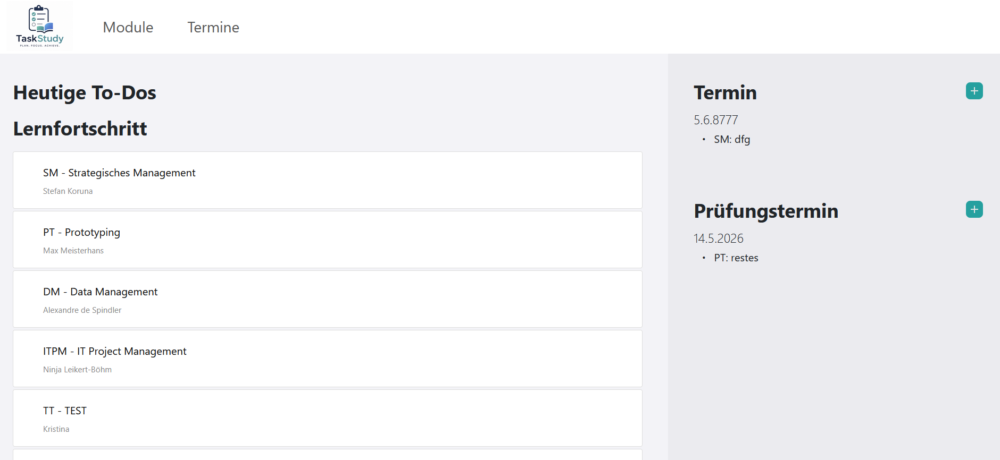
Modulübersicht:
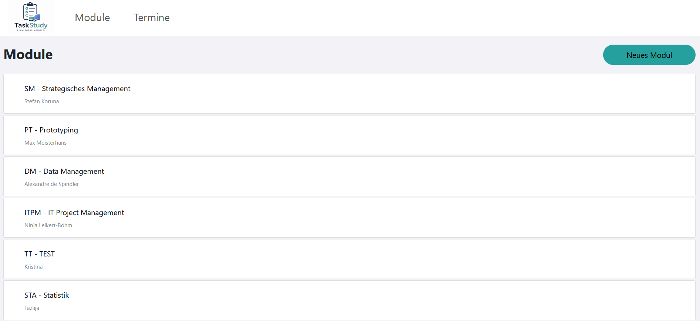
Modulansichtsseite:
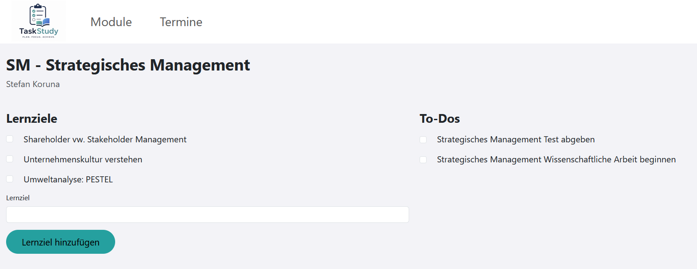
Neues Modul:
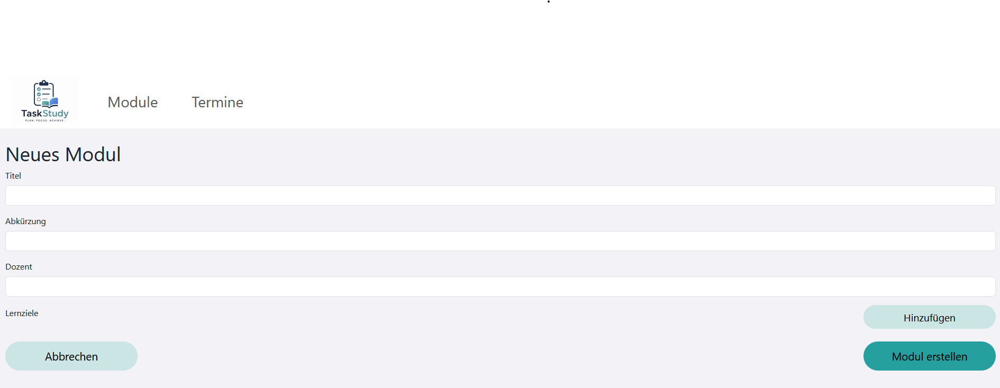
Terminübersicht:
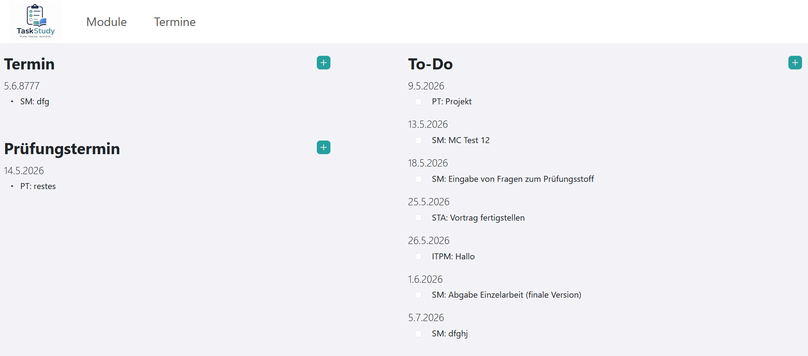
Neuer Termin:
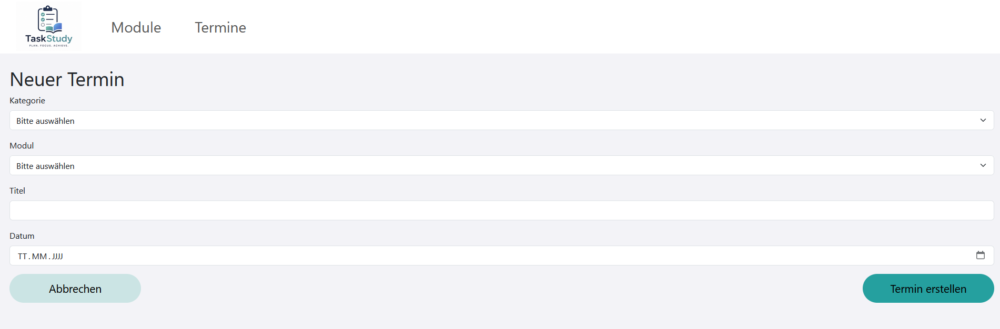
- **Ziele der Prüfung:** 
Mit dem Usability-Test sollte überprüft werden, ob Studierende die wichtigsten Funktionen der Anwendung intuitiv bedienen können. Insbesondere sollte untersucht werden, ob Module erstellt, Lernziele verwaltet und Prüfungstermine erfasst werden können sowie ob die Navigation innerhalb der Anwendung verständlich ist.
- **Vorgehen:** 
Der Test wurde moderiert durchgeführt. Die Testpersonen bearbeiteten vorgegebene Szenarien selbstständig, während ihre Interaktionen beobachtet wurden. Bei Unklarheiten wurden Rückfragen gestellt und anschliessend qualitative Rückmeldungen eingeholt.  
- **Stichprobe:** 
Getestet wurde mit Mitstudierenden, die potenzielle Nutzerinnen und Nutzer der Anwendung darstellen. Insgesamt nahmen 2 Personen teil; Iljazi Marigona und Pejakovic Kristina.
- **Aufgaben/Szenarien:** 

  **Szenario 1 – Neues Modul organisieren**
  Du beginnst ein neues Semester und möchtest deine Vorlesungen übersichtlich organisieren. Dafür möchtest du ein neues Modul hinzufügen und die wichtigsten Lernziele festhalten, damit du während des Semesters den Überblick behältst.
  **Aufgabe:**
  Ein neues Modul mit passenden Lernzielen erfassen.

  **Szenario 2 – Lernfortschritt aktualisieren**
  Du hast ein wichtiges Lernziel für das Modul „Prototyping“ vollständig bearbeitet und möchtest deinen Fortschritt aktualisieren, damit du sehen kannst, welche Lernziele bereits erreicht wurden.
  **Aufgabe:**
  Ein bestehendes Lernziel als erfüllt markieren.

  **Szenario 3 – Prüfungsvorbereitung planen**
  Du hast erfahren, wann deine nächste Prüfung stattfindet. Damit du rechtzeitig mit dem Lernen beginnen kannst, möchtest du den Prüfungstermin im entsprechenden Modul festhalten.
  **Aufgabe:**
  Einen neuen Prüfungstermin für das Modul „Prototyping“ erfassen.
- **Kennzahlen & Beobachtungen:** 

  **Positiv:**
  Das Erstellen eines neuen Moduls wurde von den Testpersonen schnell verstanden und erfolgreich durchgeführt.
  Die Grundstruktur der Anwendung wurde als übersichtlich wahrgenommen.

  **Beobachtete Probleme:**
  Die Möglichkeit, Lernziele bereits auf der Seite zur Modulerstellung hinzuzufügen, wurde von beiden Testpersonen nicht erkannt.
  Nach dem Speichern einer Aktion fehlte eine Rückmeldung (z. B. Erfolgsmeldung oder Weiterleitung), wodurch Unsicherheit entstand, ob die Aktion erfolgreich ausgeführt wurde.

- **Zusammenfassung der Resultate:**
Die zentralen Funktionen konnten grundsätzlich erfolgreich genutzt werden. Besonders das Erstellen neuer Module funktionierte intuitiv und ohne grössere Schwierigkeiten. Verbesserungspotenzial zeigte sich vor allem bei der Sichtbarkeit von Funktionen zum Hinzufügen von Lernzielen sowie beim Nutzerfeedback nach erfolgreichen Aktionen. Zudem wurden zusätzliche Funktionen gewünscht, welche die Organisation der Module weiter verbessern würden.

- **Abgeleitete Verbesserungen:** 

| Priorität | Verbesserung | Begründung |
|-----------|-------------|------------|
| Hoch | Erfolgsfeedback nach dem Speichern anzeigen | User sollen direkt erkennen können, dass ihre Aktion erfolgreich ausgeführt wurde. |
| Hoch | Filteroption integrieren | Bei einer grösseren Anzahl von Aufgaben und Terminen kann die Übersicht schnell verloren gehen. Eine Filterfunktion erleichtert das Auffinden relevanter Termine und verbessert die Benutzerfreundlichkeit. |
| Mittel | Navigation nach Aktionen optimieren | Die Rückkehr zur vorherigen Ansicht war nicht immer klar ersichtlich und führte zu Unsicherheit. |
| Mittel | Modul löschen ermöglichen | Mehrere Testpersonen erwarteten diese Funktion zur Verwaltung ihrer Module. |
| Niedrig | Module nach Semester sortieren | Verbessert die Übersichtlichkeit bei einer grösseren Anzahl von Modulen. |
| Niedrig | Suchfunktion integrieren | Erleichtert das schnelle Auffinden von Modulen, Lernzielen und Prüfungsterminen. |
| Niedrig | Login-System einführen | Ermöglicht eine personalisierte Nutzung und die dauerhafte Speicherung von Daten. |

## 4. Erweiterungen [Optional]
Dokumentiert Erweiterungen über den Mindestumfang hinaus.
> **Hinweis:** Jede Erweiterung ist separat nach dem folgenden Schema zu beschreiben.

### 4.1 Filterfunktion
- **Beschreibung & Nutzen:** Die Filterfunktion wurde ergänzt, damit Aufgaben, Termine und Prüfungstermine gezielt gefiltert werden können. Dadurch bleibt die Anwendung auch bei einer grösseren Anzahl von Einträgen übersichtlich und relevante Informationen können schneller gefunden werden.
- **Wo umgesetzt:** 
  - **Frontend:** Filterbuttons und Filterlogik in src/lib/components/TaskList.svelte. Zusätzliche Filter für Favoriten in src/routes/+page.svelte und src/routes/modules/+page.svelte.
  - **Backend:** Keine Änderungen notwendig.
  - **Datenbank:** Keine Änderungen notwendig, da die Filterung direkt im Frontend erfolgt.
- **Referenz:** Kapitel 3.4.1 User Interface Design, Screenshots der Startseite.
- **Aus Evaluation abgeleitet?:** Ja. Die Erweiterung wurde aufgrund des Feedbacks einer Testperson während der Evaluation umgesetzt. Es wurde angemerkt, dass bei vielen Aufgaben eine Filtermöglichkeit hilfreich wäre, um die Übersicht zu behalten und schneller die gewünschten To-Dos zu finden.

### 4.2 Modul löschen
- **Beschreibung & Nutzen:** Es wurde die Möglichkeit ergänzt, Module zu löschen. Dadurch können nicht mehr benötigte oder versehentlich erstellte Module einfach entfernt werden, was die Übersichtlichkeit verbessert.
- **Wo umgesetzt:** 
  - **Frontend:** Button zum Löschen eines Moduls auf der Moduldetailseite.
  - **Backend:** Form Action deleteModule in src/routes/modules/[module_id]/+page.server.js.
  - **Datenbank:** Löschfunktion für Module in src/lib/db.js.
- **Referenz:** Kapitel 3.5 Abgeleitete Verbesserungen, Testuser wollte eine Löschfunktion.  
- **Aus Evaluation abgeleitet?:** Ja. Eine Testperson erwartete diese Funktion zur Verwaltung ihrer Module.

### 4.3 Module favorisieren  
- **Beschreibung & Nutzen:** Es wurde die Möglichkeit ergänzt, Module als Favoriten zu markieren. Dadurch können besonders wichtige oder aktuell relevante Module hervorgehoben werden. Dies verbessert die Übersichtlichkeit, da sich im Verlauf eines Studiums viele Module ansammeln können. Favorisierte Module lassen sich dadurch schneller finden und von weniger relevanten Modulen unterscheiden.
- **Wo umgesetzt:** 
  - **Frontend:** Favoritenfunktion auf der Moduldetailseite sowie Filter für die Anzeige von Favoriten auf der Startseite und in der Modulübersicht.
  - **Backend:** Form Action toggleFavoriteModule in src/routes/modules/[module_id]/+page.server.js.
  - **Datenbank:** Speicherung des Favoritenstatus im Modul-Dokument sowie entsprechende Update-Funktion in src/lib/db.js.
- **Referenz:** 3.4.1 User Interface Design, Screenshot von der Startseite
- **Aus Evaluation abgeleitet?:** Nein. Die Erweiterung entstand aus einer eigenen Beobachtung während der Entwicklung. Da sich über mehrere Semester beziehungsweise Studienjahre viele Module ansammeln können, wurde eine Favoritenfunktion als sinnvolle Möglichkeit zur Verbesserung der Übersichtlichkeit und Benutzerfreundlichkeit implementiert.

### 4.4 Erfolgsfeedback nach dem Speichern
- **Beschreibung & Nutzen:** Nach dem Erstellen eines Moduls, Lernziels oder Termins werden Benutzer automatisch auf die vorherige Seite weitergeleitet. Dadurch sehen sie direkt das neu erstellte Element und erkennen sofort, dass die Aktion erfolgreich ausgeführt wurde.
- **Wo umgesetzt:** 
  - **Frontend:** Automatische Navigation zurück auf die entsprechende Übersichts- oder Detailseite.
  - **Backend:** Weiterleitungen nach erfolgreichen Form Actions in den jeweiligen +page.server.js Dateien.
  - **Datenbank:** Keine Änderungen notwendig.
- **Aus Evaluation abgeleitet?:** Ja. Während der Evaluation wurde angemerkt, dass eine Rückmeldung nach dem Speichern fehlt.

## 5. Projektorganisation
- **Issue-Management:** Es wurde kein formales Issue-Management verwendet. Offene Aufgaben, Ideen und Verbesserungen wurden während der Entwicklung laufend festgehalten und direkt umgesetzt.  
- **Commit-Praxis:** Änderungen wurden regelmässig in Git gespeichert. Die Commits wurden möglichst mit aussagekräftigen Nachrichten versehen, damit nachvollziehbar bleibt, welche Funktionen ergänzt oder angepasst wurden.

## 6. KI-Deklaration
Die folgende Deklaration ist verpflichtend und beschreibt den Einsatz von KI im Projekt.

### 6.1 KI-Tools
- **Eingesetzte Tools**:
ChatGPT (Plus) 
- **Zweck & Umfang**:
ChatGPT wurde während der Entwicklung als Unterstützung bei der Programmierung eingesetzt. Vor allem habe ich die KI für Codevorschläge, die Fehlersuche und bei der Umsetzung einzelner Funktionen verwendet. Die vorgeschlagenen Lösungen konnten jedoch selten direkt übernommen werden und mussten meist angepasst oder erweitert werden, damit sie mit meiner bestehenden Anwendung funktionieren.

Mit Unterstützung von ChatGPT wurden unter anderem folgende Funktionen umgesetzt:

- Erfassen und Verwalten von Lernzielen
- Korrektur von Fehlern in DynamicList.svelte und Funktion getTasksByModule in db.js
- Implementierung der Filterfunktion in TaskList.svelte
- Anzeige des Lernfortschritts als Prozentwert mit kreisförmiger Fortschrittsanzeige
- Unterstützung bei einzelnen Codeproblemen und Lösungsansätzen während der Entwicklung
- Vorbelegung der Kategorie beim Erstellen eines neuen Termins anhand des URL-Parameters

Die erste Filterfunktion für Aufgaben wurde mit Unterstützung von ChatGPT umgesetzt, nachdem mein eigener Lösungsansatz nicht funktioniert hatte. Auf dieser Grundlage konnte ich spätere Filter, beispielsweise den Favoritenfilter für Module, selbstständig entwickeln. Auch bei anderen Problemen, wie der automatischen Auswahl der Kategorie beim Erstellen eines neuen Termins oder den unerwarteten Seitenneuladungen beim Anklicken von Checkboxen, wurde ChatGPT zur Fehlersuche und für Lösungsvorschläge eingesetzt.

Die KI diente dabei hauptsächlich als Hilfsmittel. Ich habe ChatGPT vor allem genutzt, wenn etwas nicht wie erwartet funktioniert hat oder ich einen Lösungsansatz benötigte. Der generierte Code wurde von mir überprüft, angepasst und in die bestehende Anwendung integriert.
- **Eigene Leistung (Abgrenzung):**
Die Konzeption, Umsetzung und Gestaltung der Anwendung erfolgte grösstenteils eigenständig. Dazu gehören insbesondere:

- Die Startseite inklusive der Darstellung der heutigen To-Dos und des Lernfortschritts
- Die Modulübersicht inklusive Favoritenfunktion und Favoritenfilter
- Die Detailseiten der Module
- Das Formular zum Erstellen neuer Module
- Das Formular zum Erstellen neuer Aufgaben und Termine
- Die Navigation und Seitenstruktur der Anwendung
- Die Komponente ModuleCard.svelte
- Die Datenbankstruktur und die meisten Datenbankabfragen
- Die Verwaltung von Modulen, Aufgaben und Terminen (Erstellen, Bearbeiten und Löschen)
- Die Gestaltung des User Interfaces inklusive Farben, Layout und Button-Design
- Die Lernfortschrittsanzeige und deren Einbindung in die Modulübersicht
- Die Umsetzung der automatischen Weiterleitungen nach dem Speichern von Daten
- Alle Komponenten im Ordner modules, mit Ausnahme der Funktionen zum Erledigen und Erstellen von Lernzielen

### 6.2 Prompt-Vorgehen
Während der Entwicklung habe ich ChatGPT hauptsächlich genutzt, wenn ich bei einem Problem nicht weiterkam oder eine Funktion umsetzen wollte. Dabei habe ich möglichst genau beschrieben, was ich erreichen möchte, welche Technologien ich verwende und welche Anforderungen die Lösung erfüllen soll.

Wenn die erste Antwort nicht direkt funktioniert hat, habe ich den Prompt ergänzt, Fehlermeldungen eingefügt oder genauer erklärt, wo das Problem liegt. Oft waren mehrere Nachfragen nötig, bis eine passende Lösung gefunden wurde. Die Vorschläge von ChatGPT dienten dabei als Unterstützung und Ausgangspunkt für die weitere Umsetzung.

Den generierten Code habe ich jeweils selbst getestet und an mein Projekt angepasst. Es mussten Änderungen vorgenommen werden, damit die Lösung mit meiner bestehenden Anwendung funktioniert. Dadurch konnte ich die vorgeschlagenen Ansätze besser verstehen und in meine eigene Projektstruktur integrieren.

Bei der Dokumentation und der Umsetzung des Projekts habe ich darauf geachtet, die Inhalte kritisch zu prüfen und nicht ungefiltert zu übernehmen. Die Verantwortung für die fertige Anwendung sowie für alle Anpassungen und Entscheidungen lag bei mir.

### 6.3 Reflexion
Die Arbeit an diesem Projekt hat mir insgesamt viel Spass gemacht. Besonders motivierend war es, eine Anwendung von der ersten Idee bis zu einem funktionierenden Produkt selbst umzusetzen.

Eine Herausforderung war für mich das Zeitmanagement. In den letzten Wochen des Semesters standen gleichzeitig mehrere Abgaben und Prüfungen an, weshalb es teilweise schwierig war, genügend Zeit für das Projekt einzuplanen. Dadurch musste ich einige Arbeiten unter Zeitdruck erledigen.

Während der Entwicklung bin ich immer wieder auf Fehler gestossen, bei denen zeitweise die gesamte Anwendung nicht mehr funktionierte. Oft stellte sich nach längerer Fehlersuche heraus, dass nur eine Variable falsch geschrieben war oder ein kleiner Fehler im Code vorlag. In solchen Momenten war ich manchmal kurz vor der Verzweiflung, weil ich dachte, ich hätte die ganze Anwendung kaputt gemacht. Im Nachhinein waren diese Situationen aber sehr lehrreich, da ich gelernt habe, Fehler systematisch zu suchen und zu beheben.

Rückblickend würde ich ausserdem die Benennung von Variablen und Datenbankfeldern von Anfang an konsequenter gestalten. Zu Beginn habe ich die Datenbank auf Deutsch aufgebaut, während ich die Variablen im Code grösstenteils auf Englisch benannt habe. Dadurch kam ich teilweise durcheinander und verursachte unnötige Fehler.

Ein Risiko während der Entwicklung war, dass ich Variablen oder Datenbankfelder gelegentlich verwechselt habe. Dadurch funktionierten einzelne Teile der Anwendung manchmal nicht mehr korrekt und die Fehlersuche kostete oft viel Zeit. Zudem gab es längere Pausen zwischen einzelnen Entwicklungsphasen. Nach solchen Unterbrüchen musste ich mich jeweils zuerst wieder in den bestehenden Code einarbeiten, was den Entwicklungsprozess verlangsamt hat.

Zur Qualitätssicherung habe ich jede Änderung direkt nach der Umsetzung getestet. Dadurch konnten Fehler meistens früh erkannt und behoben werden, bevor sie weitere Teile der Anwendung beeinflussten. Besonders bei Formularen, Datenbankabfragen und neuen Funktionen habe ich nach jeder Anpassung überprüft, ob die Anwendung weiterhin wie erwartet funktioniert. Zusätzlich wurde die Anwendung von mehreren Personen getestet. Das erhaltene Feedback half dabei, Fehler zu entdecken und die Benutzerfreundlichkeit weiter zu verbessern. Mehrere Erweiterungen, wie die Filterfunktion oder die Möglichkeit, Module zu löschen, entstanden direkt aus diesen Rückmeldungen.

Insgesamt habe ich während dieses Projekts sehr viel Neues gelernt, insbesondere im Umgang mit SvelteKit, Komponenten, Formularen und der Anbindung einer Datenbank. Auch wenn es zwischendurch frustrierende Momente gab, bin ich mit dem Ergebnis zufrieden und konnte viele praktische Erfahrungen sammeln, die mir bei zukünftigen Projekten sicher weiterhelfen werden.

## 7. Anhang
Beispiele:
- **Quellen:** 
  - Logo erstellt mit ChatGPT Plus auf Basis eigener Vorgaben zu Farben und Gestaltung.
  - Bootstrap-Dokumentation Navigationsleiste: https://getbootstrap.com/docs/4.0/components/navbar/